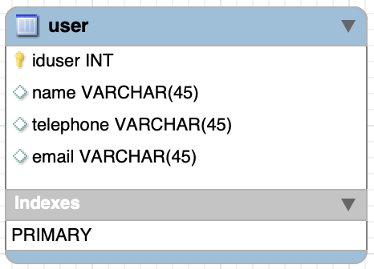
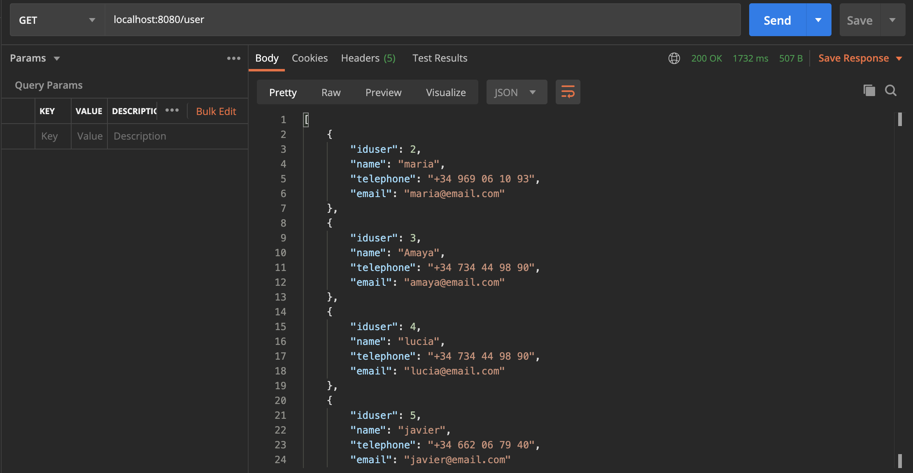
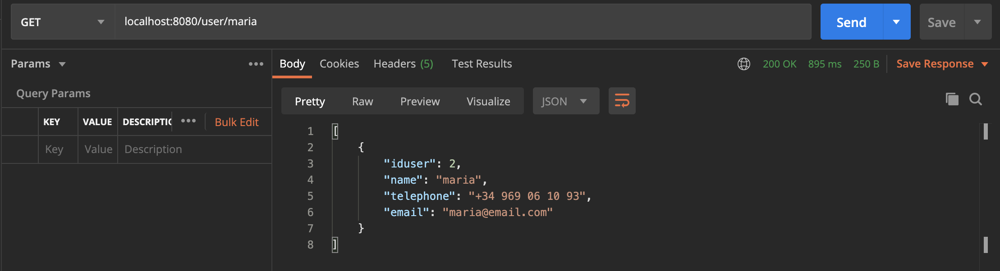
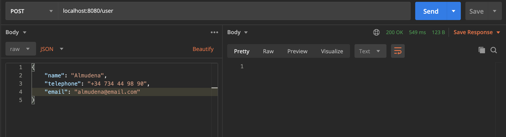
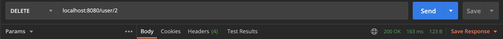
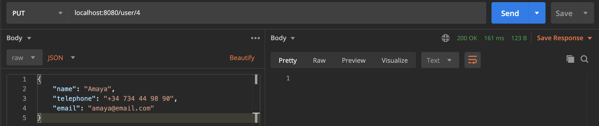

# Ejemplo simple de _API REST_ en _Java SpringBoot_

Se trata de un ejemplo simple de API REST desarrollado en _SpringBoot_.
Que gestiona un registro de usuarios almacenados en una base de datos MySQL
a través de una APIRest.

> El ejemplo se ha probado con el IDE [IntelliJ Community](https://www.jetbrains.com/idea/download/#section=mac)

La API permite realizar acciones de _CRUD_ _(Create,Read,Update,Delete)_ sobre una tabla con la siguiente estructura:



## Endpoints

La API presenta los siguientes _endpoints_

| Metodo  | Endpoint            | Descripción                            |
|---------|---------------------|----------------------------------------|
| `GET`   | `/user`             | Lista todos los usuarios               |
| `GET`   | `/user/<userName>`  | Obtiene la información de un usuario   |
 | `POST`  | `/user`             | Registra un nuevo usuario              |
| `DELETE` | `/user/<idUsuario>` | Elimina un usuario                     |
| `PUT`   | `/user/<idUsuario>` | Actualiza la información de un usuario |

## Start

* 1.- Creamos la base de datos e insertamos registros

```sql 
SET @OLD_UNIQUE_CHECKS=@@UNIQUE_CHECKS, UNIQUE_CHECKS=0;
SET @OLD_FOREIGN_KEY_CHECKS=@@FOREIGN_KEY_CHECKS, FOREIGN_KEY_CHECKS=0;
SET @OLD_SQL_MODE=@@SQL_MODE, SQL_MODE='TRADITIONAL,ALLOW_INVALID_DATES';

-- -----------------------------------------------------
-- Schema mydb
-- -----------------------------------------------------

-- -----------------------------------------------------
-- Schema mydb
-- -----------------------------------------------------
CREATE SCHEMA IF NOT EXISTS `mydb` DEFAULT CHARACTER SET utf8 ;
USE `mydb` ;

-- -----------------------------------------------------user
-- Table `mydb`.`user`
-- -----------------------------------------------------
CREATE TABLE IF NOT EXISTS `mydb`.`user` (
  `iduser` INT NOT NULL AUTO_INCREMENT,
  `name` VARCHAR(45) NULL,
  `telephone` VARCHAR(45) NULL,
  `email` VARCHAR(45) NULL,
  PRIMARY KEY (`iduser`))
ENGINE = InnoDB;


SET SQL_MODE=@OLD_SQL_MODE;
SET FOREIGN_KEY_CHECKS=@OLD_FOREIGN_KEY_CHECKS;
SET UNIQUE_CHECKS=@OLD_UNIQUE_CHECKS;
```

```sql
INSERT INTO `mydb`.`user` (`name`, `telephone`, `email`) VALUES ('maria', '+34 969 06 10 93', 'maria@email.com');
INSERT INTO `mydb`.`user` (`name`, `telephone`, `email`) VALUES ('juan', '+34 629 26 35 09', 'juan@email.com');
INSERT INTO `mydb`.`user` (`name`, `telephone`, `email`) VALUES ('lucia', '+34 734 44 98 90', 'lucia@email.com');
INSERT INTO `mydb`.`user` (`name`, `telephone`, `email`) VALUES ('javier', '+34 662 06 79 40', 'javier@email.com');
```

* 2.- Configuramos el `datasource` de la aplicación para que se conecte al servidor de base de datos _MySQL_ en `src/main/resources/application.yml`

```yaml
spring:
  datasource:
    url: "jdbc:mysql://localhost:3307/mydb"
    username: "root"
    password: "root"
```

* 3.- Hacemos `build` de la aplicación y arrancamos el servidor.

* 4.- Probamos la API.

> Podemos emplear [POSTMAN](https://www.postman.com/) para testear la API.

+ Listado de usuarios



+ Información de un usuario



+ Alta de un nuevo usuario



+ Eliminación de un usuario por su id



+ Update de un usuario por su id




# Referencias

- https://spring.io/guides/gs/spring-boot/#initial